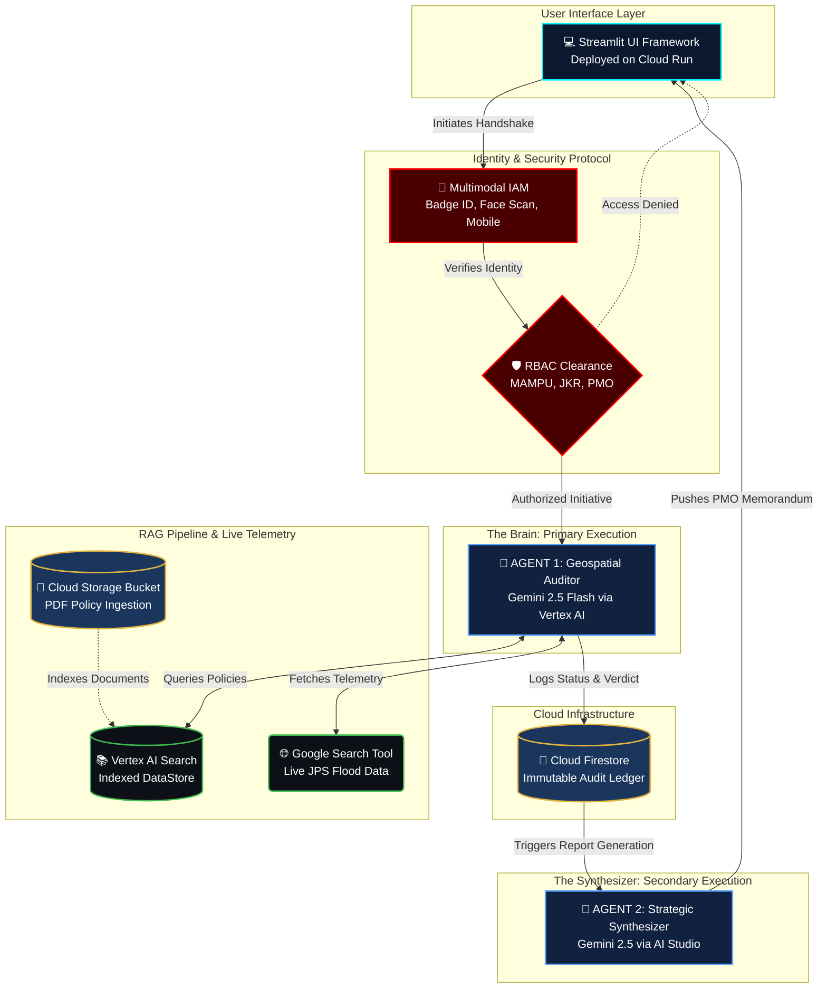

# 🛡️ MyBENTENG: National Geospatial Audit Terminal

**Event:** Project 2030: MyAI Future Hackathon  
**Track:** Track 2 - Citizens First (GovTech & Digital Services)  
**Deployment Platform:** Google Cloud Run  
**Development Environment:** Google Antigravity IDE  

---

## 📖 1. Executive Summary
Aligning with the Malaysia Madani framework and MyDIGITAL blueprints, **MyBENTENG** (Digital Floodwall) is an Agentic AI-powered GovTech terminal designed to eliminate bureaucratic friction and address the recurring national crisis of annual floods. 

By shifting from a traditional "technology consumer" to a "Sovereign Technology Builder," MyBENTENG utilizes Google's advanced AI ecosystem to automate real-time geospatial auditing, topography verification, and policy enforcement across multiple government agencies including **MKN (Security)**, **MAMPU (GovTech)**, **JKR (Infrastructure)**, and **JPS (Irrigation & Drainage)**.

---

## 🧠 2. System Architecture & Workflow Diagram
MyBENTENG moves beyond simple "chat" into **Autonomous Execution** using a multi-agent architecture (A2A).




## ✨ 3. Core Features & Capabilities

* **Multimodal Intelligence:** Accepts standard text queries, topographical PDF/Image evidence uploads, and processes Encrypted Voice Channel inputs using Gemini's multimodal transcription capabilities.
* **Live Grounding & Telemetry:** Does not rely on hallucinated or hardcoded data. The AI autonomously uses the Google Search Tool to fetch live internet telemetry (weather, news, JPS warnings) before making an infrastructure decision, providing clickable HTTPS source URLs.
* **Military-Grade RBAC Security:** Dynamic UI and AI capability rendering based on government clearance levels. The AI actively rejects prompt injection attempts to bypass departmental protocols.
* **Agent-to-Agent (A2A) Reporting:** The primary auditor agent hands off data to a secondary reporting agent (Google AI Studio) to automatically draft confidential executive summaries.
* **Bilingual Government Compliance:** Full UI toggle and dynamic AI response generation in both English and professional Bahasa Melayu, catering to local municipal requirements.

---

## 💻 4. Technology Stack

* **Language:** Python 3.9+
* **Frontend UI:** Streamlit (Custom GovTech CSS injection)
* **Primary AI Engine:** Vertex AI (`gemini-2.5-flash`)
* **Retrieval-Augmented Generation (RAG):** Vertex AI Search (Data Stores)
* **Real-time Grounding:** Google Search Tool (GAPIC)
* **Secondary Reporting Agent:** Google AI Studio (`google.generativeai`)
* **Database:** Google Cloud Firestore (Live Audit Ledger)
* **Deployment & Hosting:** Google Cloud Run (Containerized)
* **Development IDE:** Google Antigravity

---

## 🛠️ 5. Local Setup & Installation Instructions

To run this application locally for testing and development:

### Prerequisites
* Python 3.9+ installed on your machine.
* A valid Google Cloud Project with Vertex AI and Firestore APIs enabled.
* A Google AI Studio API Key.
* A Google Cloud Service Account JSON key (`new-cloud-key.json`) placed in the root directory.

### Installation
1. **Clone the repository:**
   ```bash
   git clone https://github.com/YOUR_GITHUB_USERNAME/MyBENTENG.git
   cd MyBENTENG
2. **Install required dependencies:**
   ```bash
   pip install streamlit google-cloud-aiplatform google-cloud-firestore google-generativeai python-dotenv
3. **Configure Environment Variables:**
   Create a .env file in the root directory and add your AI Studio key for the secondary reporting agent:
   ```bash
   GOOGLE_API_KEY=your_gemini_api_key_here
4. **Launch the Application:**
    ```bash
    streamlit run main.py

---
    
## 🔐 6. System Access & Test Credentials

**SECURITY NOTICE:** In strict compliance with the Project 2030 Hackathon Official FAQs, hardcoded passwords and database access keys are NOT included in this public repository.

The application is fully deployed and publicly accessible via Google Cloud Run without requiring a local environment setup. Evaluators and Judges can find the specific Badge IDs (Test Credentials) required to bypass the multi-modal IAM login screen securely submitted via the Official Submission Google Form.

---

## ⚖️ 7. Mandatory AI Disclosure & Ethics Compliance

In accordance with Section 4 (Code of Conduct & Plagiarism Policy) of the Project 2030 Official Handbook, I hereby explicitly disclose that AI coding assistants (Google Gemini) were utilized during the development of this project. Gemini was used for brainstorming logic structures, formatting UI/CSS elements, and debugging Google Cloud API integrations.

All core architectural decisions, prompt engineering, database schemas, and multi-agent workflows were fundamentally designed, orchestrated, and validated by human logic to ensure ethical alignment, safety, and national relevance.
