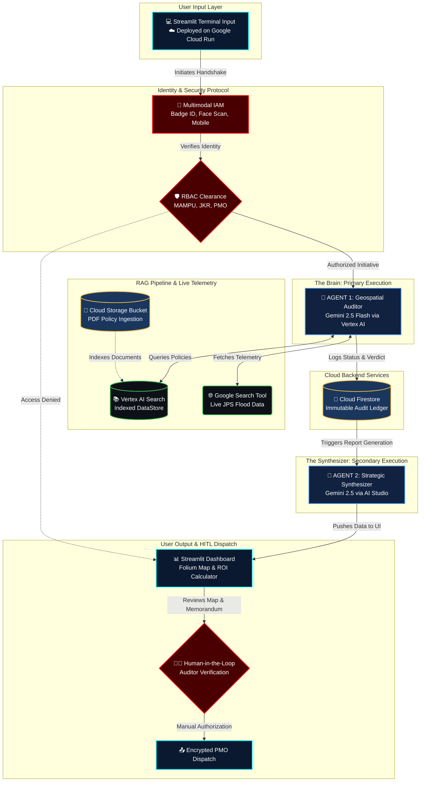

# 🛡️ MyBENTENG: National Geospatial Audit Terminal

**Event:** Project 2030: MyAI Future Hackathon  
**Track:** Track 2 - Citizens First (GovTech & Digital Services)  
**Deployment Platform:** Google Cloud Run  
**Development Environment:** Google Antigravity IDE  

---

## 📖 1. Executive Summary

Aligning with the Malaysia Madani framework and MyDIGITAL blueprints, **MyBENTENG** (Digital Floodwall) is an Agentic AI-powered GovTech terminal designed to eliminate bureaucratic friction and address the recurring national crisis of annual floods. 

By shifting from a traditional "Technology consumer" to a "Sovereign Technology Builder," MyBENTENG utilizes Google's advanced AI ecosystem to automate real-time geospatial auditing, topography verification, and policy enforcement across multiple government agencies including **MKN (Security)**, **MAMPU (GovTech)**, **JKR (Infrastructure)**, and **JPS (Irrigation & Drainage)**. 

Crucially, the architecture enforces a strict Human-in-the-Loop (HITL) protocol paired with a dynamic taxpayer ROI calculator, ensuring that AI accelerates bureaucratic efficiency without ever compromising human accountability or national budgets.

---

## 🧠 2. System Architecture & Workflow Diagram

MyBENTENG moves beyond simple "Chat" into **Autonomous Execution** using a Multi-Agent Architecture (A2A).



### 🔄 Deep-Dive: System Workflow & Data Pipeline

The MyBENTENG architecture operates on a highly secure, Agent-to-Agent (A2A) autonomous workflow designed for zero-latency government operations. The lifecycle begins at the User Input Layer, hosted entirely on Google Cloud Run for serverless scalability. When a government officer logs in, they are intercepted by a Multimodal IAM Protocol that accepts Badge IDs, Facial Scans, or Mobile Tokens. Upon authentication, an RBAC (Role-Based Access Control) Gatekeeper evaluates their departmental clearance, dynamically limiting audit capabilities to their specific jurisdiction to block unauthorized cross-agency queries. Once cleared, the query routes to Agent 1, the Geospatial Auditor, powered by Gemini 2.5 Flash via Vertex AI. Operating under strict dynamic system instructions, this primary agent analyzes the multimodal input—whether text, voice, or topographical files and prepares for real-world verification.

To eliminate AI hallucination, Agent 1 is structurally restricted from issuing a verdict until it completes a dual-grounding process. It first queries an internal Vertex AI Search DataStore to verify the input against National Infrastructure Policies, and then autonomously triggers the Google Search API to extract live internet telemetry, specifically targeting real-time flood warnings and weather data from JPS (Jabatan Pengairan dan Saliran). After synthesizing this data, Agent 1 issues a definitive safety verdict. Before this decision reaches the user, the entire transaction including officer credentials, timestamps, and network status is permanently written to a Google Cloud Firestore Database, establishing the immutable, tamper-proof audit ledger required for strict government transparency.

Finally, the system initiates its autonomous bureaucracy reduction phase. The Firestore log automatically triggers Agent 2, a Strategic Synthesizer powered by the Google AI Studio SDK. This secondary agent autonomously ingests the raw chat history and database logs, synthesizing them into a highly formal, bilingual Executive Memorandum in both English and Bahasa Melayu Baku. This PMO-ready report, alongside a dynamically rendered Folium risk map and financial ROI calculator, is instantly pushed back to the Streamlit Output Layer. However, to ensure strict government accountability, the system enforces a Human-in-the-Loop (HITL) pause. A cleared human auditor must manually review the visual map and text memorandum before authorizing the final Encrypted PMO Dispatch, completing the cycle and entirely eliminating the manual paperwork traditionally associated with government audits.

---

## ✨ 3. Core Features & Capabilities

* **Multimodal Intelligence:** Accepts standard text queries, topographical PDF/Image evidence uploads, and processes Encrypted Voice Channel inputs using Gemini's multimodal transcription capabilities.
* **Live Grounding & Telemetry:** Does not rely on hallucinated or hardcoded data. The AI autonomously uses the Google Search Tool to fetch live internet telemetry (weather, news, JPS warnings) before making an infrastructure decision, providing clickable HTTPS source URLs.
* **Interactive Geospatial Risk Mapping:** Dynamically intercepts AI metadata to render a live, military-style `folium` map, dropping visual Red/Green zone radiuses directly on audited locations.
* **Taxpayer ROI Calculator:** Automatically calculates the estimated disaster repair costs avoided by rejecting bad permits, proving immediate financial impact to government budgets. 
* **Human-in-the-Loop (HITL) Dispatch:** While the AI drafts the executive reports, zero government action is taken without human authorization. A secure PMO dispatch workflow requires manual approval from a cleared auditor.
* **Military-Grade RBAC Security:** Dynamic UI and AI capability rendering based on government clearance levels. The AI actively rejects prompt injection attempts to bypass departmental protocols.
* **Agent-to-Agent (A2A) Reporting:** The primary auditor agent hands off data to a secondary reporting agent (Google AI Studio) to automatically draft confidential executive summaries.
* **Bilingual Government Compliance:** Full UI toggle and dynamic AI response generation in both English and professional Bahasa Melayu, catering to local municipal requirements.

---

## 💻 4. Technology Stack

* **Language:** Python 3.9+
* **Frontend UI:** Streamlit (Custom GovTech CSS injection)
* **Geospatial Rendering:** Folium & Streamlit-Folium (Interactive Risk Mapping)
* **Primary AI Engine:** Vertex AI (`gemini-2.5-flash`)
* **Retrieval-Augmented Generation (RAG):** Vertex AI Search (Data Stores)
* **Real-time Grounding:** Google Search Tool (GAPIC)
* **Secondary Reporting Agent:** Google AI Studio (`google.generativeai`)
* **Database:** Google Cloud Firestore (Live Audit Ledger)
* **Deployment & Hosting:** Google Cloud Run (Containerized)
* **Development IDE:** Google Antigravity

---

## 🛠️ 5. Local Setup & Installation Instructions

To run this application locally for testing and development:

### Prerequisites
* Python 3.9+ installed on your machine.
* A valid Google Cloud Project with Vertex AI and Firestore APIs enabled.
* A Google AI Studio API Key.
* A Google Cloud Service Account JSON key (`new-cloud-key.json`) placed in the root directory.

### Installation
1. **Clone the repository:**
   ```bash
   git clone https://github.com/Jxxy123/MyBENTENG.git
   cd MyBENTENG
2. **Install required dependencies:**
   ```bash
   pip install streamlit google-cloud-aiplatform google-cloud-firestore google-generativeai python-dotenv folium streamlit-folium
3. **Configure Environment Variables:**
   Create a .env file in the root directory and add your AI Studio key for the secondary reporting agent:
   ```bash
   GOOGLE_API_KEY=your_gemini_api_key_here
4. **Launch the Application:**
    ```bash
    streamlit run main.py

---
    
## 🔐 6. System Access & Test Credentials

**SECURITY NOTICE:** In strict compliance with the Project 2030 Hackathon Official Handbook, hardcoded passwords and database access keys are **NOT** included in this public repository. 

The application is fully deployed and publicly accessible via Google Cloud Run without requiring a local environment setup. Evaluators and Judges can find the specific **Badge IDs** (Test Credentials) required to bypass the multi-modal IAM login screen securely submitted via the **Official Submission Google Form**.

**Demo Day Note:** The "Badge ID" login is fully functional and actively queries the live Cloud Firestore database. The "Facial Scan" and "Thumbprint" options are high-fidelity UX simulations designed to demonstrate the intended multimodal workflow for future hardware integration.

---

## ⚖️ 7. Mandatory AI Disclosure, Ethics & Methodology

In accordance with Section 4 (Code of Conduct & Plagiarism Policy) of the Project 2030 Official Handbook, I hereby explicitly disclose the use of AI coding assistants (Google Gemini) during the development of this project. 

**Development Methodology: Prompt-Driven Development (PDD)**
This application was engineered utilizing a Prompt-Driven Development (Natural Language Programming) methodology. While the core idea, conceptualization, and problem-solving strategy for MyBENTENG are 100% my original work, Google Gemini was utilized strictly as an automated execution tool. Specifically, it was deployed to generate Python syntax, inject custom Streamlit CSS/UI components, format API payloads, and debug Google Cloud integrations.

**Originality & Human Oversight:**
While AI handled the syntax and boilerplate code execution, I operated strictly as the Lead Architect. All core architectural decisions, prompt engineering, database schemas, Agent-to-Agent (A2A) orchestration, and Role-Based Access Control (RBAC) security guardrails were fundamentally designed, orchestrated, and validated by human logic to ensure ethical alignment, safety, and national relevance.
